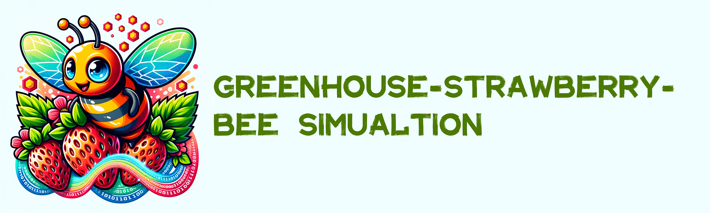
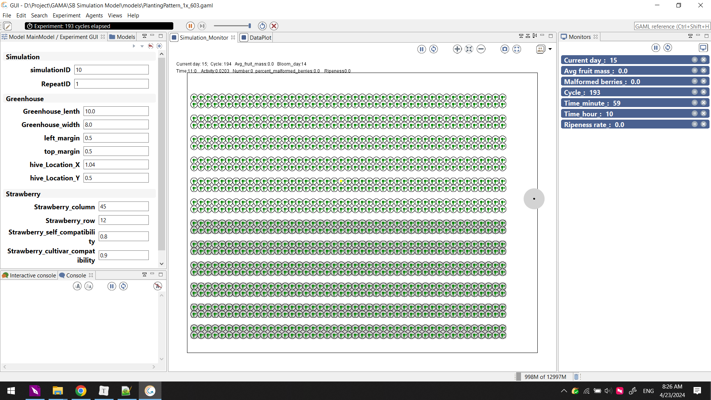

# Greenhouse-Strawberry-Bee Simulation

 

### Basic model

This repository in file [Basic Simulation Model](https://github.com/czh16/Greenhouse_Strawberry_Bee_Simulation/tree/main/Basic%20Simulation%20Model) contains the code and hyperparameters for the paper:

[Cao, Zhihao, et al. "Effects of bee density and hive distribution on pollination efficiency for greenhouse strawberries: A simulation study." *Agronomy* 13.3 (2023): 731.](https://www.mdpi.com/2073-4395/13/3/731)

The project is based on [GAMA platform](https://github.com/gama-platform) and the version is GAMA1.8.

